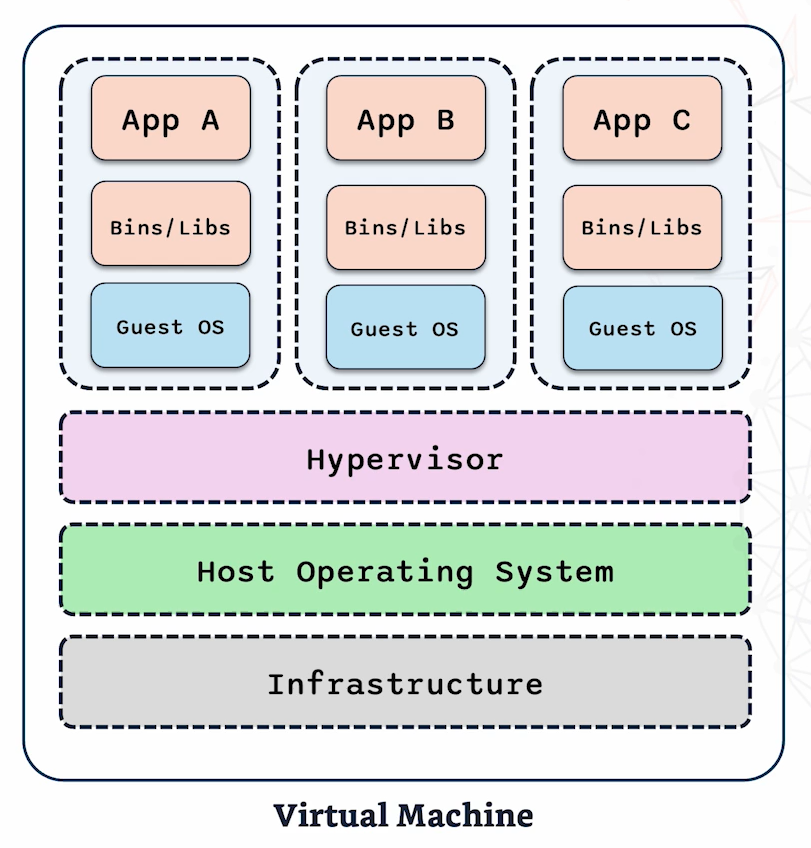

# DevOps-Learning-Docker
Repository containing topics I learnt in the CoderCo Docker Module.

## What are Containers?
Lightweight, portable units for running an application. They bundle an application with all its dependancies, ensuring it runs consistently across different environments. Because they are isolated, they run the same on any environment. Docker containers sit above the Docker Engine. Each container contains the app and its binaries and libraries which are required to run. The Docker Engine sits in line with the host operating system which sits above the infrastructure. This isolation ensures each app runs consistently, regardless of the environment. 

## Benefits of Containers
- Isolation: Each container is isolated. They have their own environments for each application (They isolate applications from each other and the underlying system). Prevents conflict and ensures application runs smoothly without interfering with each other. E.g. App1 runs with Python 2.7 and App2 runs with Python 3.8, containers keep them separate so they don't clash.
- Consistent environment for applications to run: Behave the same way, regardless of where it is deployed. Eliminates "It works on my machine" problem. Making development and deployment more predictable and reliable. 
- Efficient: They are more resource efficient compared to traditional VMs. They share the host kernel. Reduces overhead and allows for more containers to run on the same hardware. Faster to start up and less resource intensive. 

## What is Docker?
Open platform for developing, shipping and running applications in containers. Simplifies the process of managing containers, making it easier to build, deploy and run applications. Docker has several key components which make it a powerful tool:
- Docker Engine: A portable and lightweight application runtime and packagaing tool.
- DockerHub: A cloud service for sharing applications and automating workflows.
- Docker Compose: A tool for defining and running multi-container Docker applications.

## Images and Containers
Images are templates for creating containers. Images are immutable (They do not change once created) unless recreated. Immutability ensures the application runs consistently, no matter where it is deployed.

Containers are running instances of the images. Containers are what we actually interact with. They run the application and we are able to start, stop and modify them as needed.

To create an image, we create a Dockerfile which contains a series of instructions that is used to assemble an image.

## Importance in Modern Development
- Simplified Deployment: Docker simplifies deployment by ensuring consistency across environments.
- Improved Efficiency: Lightweight and start up almost instantly, using little resources.
- Enhanced Collaboration: Easy to share development environments and applications with other team members. All you need to do is share the Docker image. Onboarding new developers becomes faster and less error prone.

## VMs vs Containers
VMs: Allows multiple OS's to operate on a single physical machine. A diagram can be seen below

- Infrastructure: The physical or virtual hardware.
- Host OS: The primary OS managing all the resources.
- Hypervisor: Responsible for creating and managing VMs by allocating resources such as CPU and memory.
- VM: Each VM runs a full guest OS which is isolated from others. VMs also have their own binaries, libraries and anything else an application would need to run. This means each VM can be resource heavy, requiring CPU, memory and storage.

Containers: More lightweight and efficient way to isolate applications. They share the host OS like VMs but instead of using a hypovisor, they use the Docker Engine which sits on top of the host OS. Containers are isolated from each other from the process level but share the underlying OS which makes them much lighter than VMs. They do not have a guest OS, rather they share the host OS. Each container contains the application and the dependancies but without the need for a full guest OS as can be seen below. They are more portable than VMs.

Process Level Isolation: They share the host OS kernel but are isolated within the container itself (processes run within the container). 

### Which is better?
- Startup Times: For startup times, container are the way as they take seconds to startup as they share the host OS compared to VMs which need to boot up the whole guest OS and can take minutes.
- Resource Usage: For resource usage, containers are the better choice as they are resource efficient as VMs require a full guest OS, consuming significant resources. Containers only use only what is necessary for the application and dependancies.
- Isolation: VMs offer more isolation as each VM have their own OS. Containers offer process level isolation (They share the host OS kernel but are isolated within the container itself (processes run within the container)), this is sufficient but not as isolated as a VM. 
- Portability: VMs are less portable due to their size and dependacy on specific hypervisors. Containers are more portable and consistent due to the Docker Image format.

## Docker Images
A Dockerfile is a series of instructions on how to build a Docker image. Each instruction creates a layer in the image, making it easier to track changes and optimise builds. 
Key commands of a Dockerfile:
- FROM: Specifies the base image to use for the Docker image.
- RUN: Executes commands in the container e.g. installing packages and updating dependancies.
- COPY: Copies files from the host machine into the container e.g. application code and requirements.txt. 
- WORKDIR: Sets the working directory for subsequent instructions. Ensures commands are run in the correct directory within the container.
- EXPOSE: Exposes the specified network port on the container at runtime.
- CMD: Specifies the command to run when the container starts. The final instruction that defines the behaviour of the container once its up and running.

An example dockerfile can be found in the hello_flask directory.

Once you have created a Dockerfile, to build it, run the command `docker build -t image_name .` where -t tags the image with the specified name and . represents the directory.

To then run the container, you can run the command `docker run -d -p 5002:5000 image_name` where `-d` signifies detached mode, and `-p 5002:5000` specifies we want 5002 on the host machine to be mapped to 5000 on the container.

We can view running containers by running `docker ps` and non-running containers which have exited using `docker ps -a`.

To stop the container, we run the command `docker stop container_id`.

## Docker Networking
Docker networking allows Docker containers to communicate with each other. There are 3 types:
- Bridge Network: Default network mode for containers on the same machine. Containers connected to the bridge network can communicate to each other using their own IP addresses. Isolated from the host machines network which provides a extra layer of security.
- Host Network: The container uses the host machines network directly without any isolation. There is no distinction between the container and the host. Useful for applications that need to closely interact with the host system.
- None Network: No network interface at all. Completely isolated. Useful for certain security scenarios.

Docker networking is important in DevOps as it simplifies the implementation of microservices architecture. Microservices allow different parts of an application to run as independant services, each in its own container. Docker networking ensures these services can communicate with each other efficiently and securely. Therefore, you can choose which network type you want for each interaction regardless of where they are running. Dockers networking service is highly scalable, you can easily connect and scale services as your application grows.

### Linking Containers Together
- To create a network, run the command `docker network create network-name`.
- To run the MySQL container, run the command `docker run -d --name mydb --network my-custom-network -e MYSQL_ROOT_PASSWORD=my-secret-pw mysql:5.7`. This runs a docker container which pulls the MySQL image from DockerHub, sets the name as mydb, specifies the custom network we made and sets the password.
- Now to build the docker image for the flask app, we run the command `docker build -t hello-flask-mysql .`
- Now run the container using the command `docker run -d --name myapp --network my-custom-network -p 5002:5000 hello-flask-mysql`

There were initial issues when running this. `docker logs myapp` was used to debug this issue.

## Docker Compose
A powerful and efficient way to manage multi-container Docker applications. Allows you to spin up all your containers with a single command. Automatically creates a network for your containers. 

Benefits:
- Makes development and testing easier: Allows you to spin up the exact environment you need with all the necessary services. Everything is defined in a docker-compose.yaml file and can be brought up with one command, making it easier to replicate production environment for testing.
- Consistency: Ensures all environments are the same for all developers. The docker-compose.yaml file ensures all deployments are consistent for developer, tester and CICD pipeline. Reduces bugs and errors, leading to more reliable software.
- Enhances teamwork: Easier to share code, configurations and environment setup as everyone working on the same environment. Simplier to version control infrastructure alongside code.

To run a docker-compose file, you use the command `docker-compose up -d` and to take it down, you run the command `docker compose down`. And to check the logs, we run the command `docker-compose logs`.

## Docker Registries
Docker registries are crucial for managing, storing and deploying your Docker images. A storage and distribution hub for your images. Public registries like DockerHub are open to everyone. Private registries are secure and restricted. Allow you to control who has access to your images.

Importance of Docker Registries:
- Streamline Deployment: Once images are stored in a registry, they can be easily accessed and deployed across multiple environments, making it faster and more reliable to roll out new features or updates
- Enhances Collaboration: Makes it easier for teams to access the same resources, making it easier to share and manage images.
- Ensures Consistency: Ensures the exact same image is used for development, testing and production. 

To log into DockerHub from your command line, you run the command `docker login` and follow the instructions given.

### DockerHub push process
First create a new repository on DockerHub. You would then need to build the image locally with the correct tags using the command `docker build -t username/repo_name:tag .`
Then use the command `docker push username/repo_name:tag` to push the image to DockerHub.

You can also pull images using the `docker pull username/repo_name:tag` command.

### AWS ECR
Login to AWS ECR and create a private repository. Click on the repository and click on "View push commands". This will provide instructions on how to login on the CLI as well as how to push images. Follow these instructions.

To pull the image, you run the command `docker pull *URI*` where the URI is found on the image repository.

## Important commands to know
- `docker images`: Lists all the images on the system.
- `docker inspect image_id`: Provides details about the image.
- `docker rmi image_id`: Removes specified image. Must not be running and must be removed.
- `docker system prune`: Removes all unused docker objects (images, networks, cache, etc).
- `docker ps`: Shows running containers.
- `docker rm container_id`: Removes specified container (must be in a stopped state).

## Making Image Lighter: Multistage Builds
To make an image lighter, we can use multistage builds. These allow you to use multiple `FROM` statements in your dockerfile. This will use one stage to build the application and another lighter stage to create the final image that we will actually deploy. The first stage will involve all the dependancies we need to build the application but all these dependancies will not be required in the actual final image, allowing us to discard any unneccessary files and dependancies resulting in a smaller image.

## Kubernetes
Kubernetes is an open sourced platform, designed to automate the deployment, scaling and operation of containerised applications. Provides orchestration, automatic scaling and self healing. Ensure your application runs smoothly no matter the scale. Helps developers focus on application code rather than managing containers. 